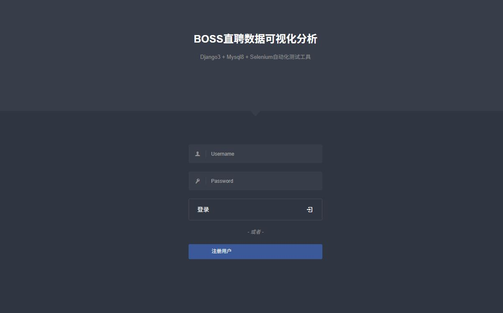
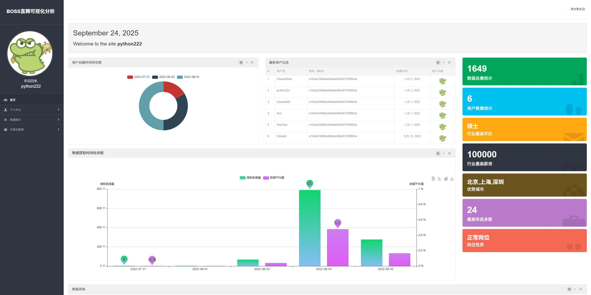
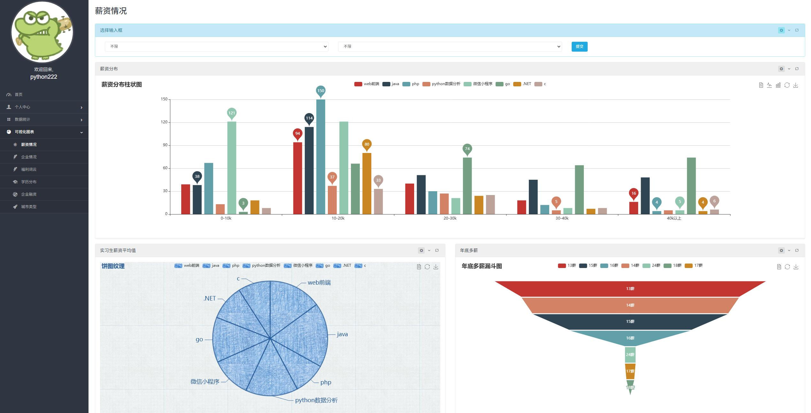
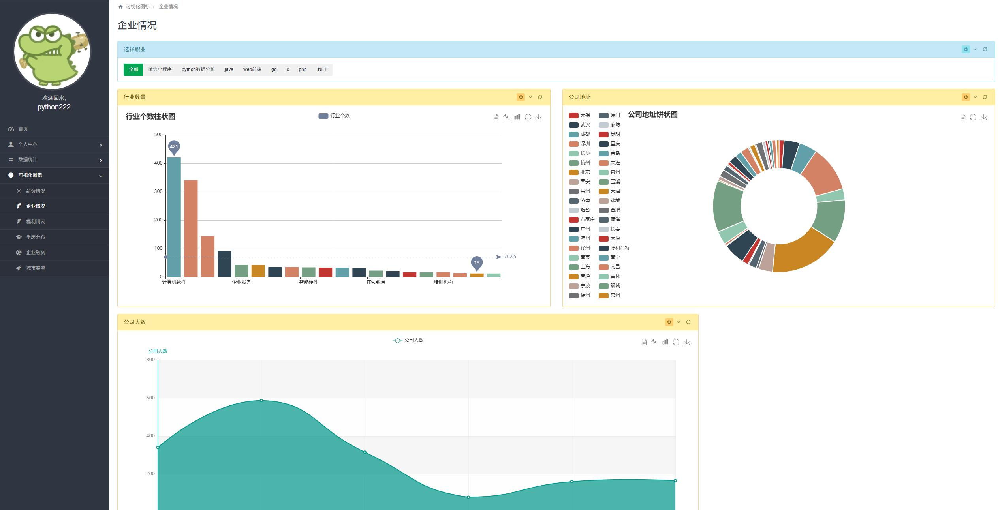
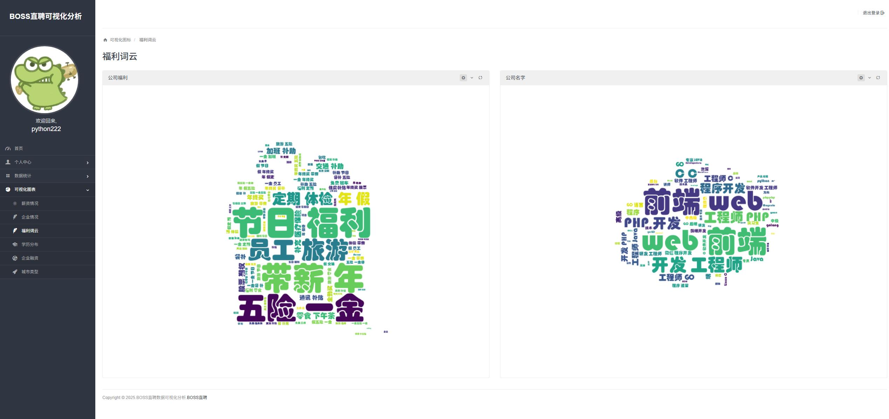
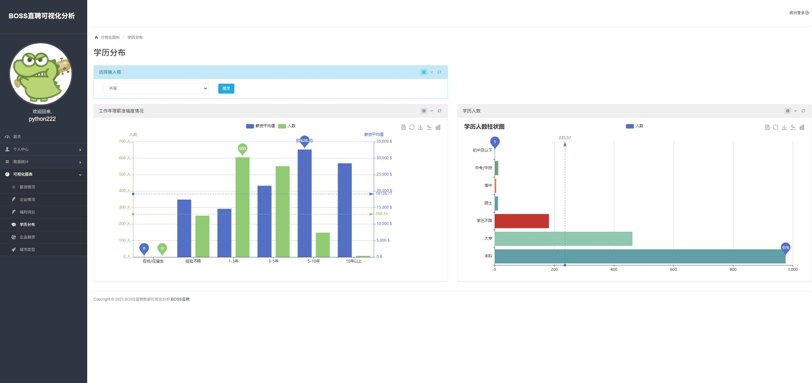
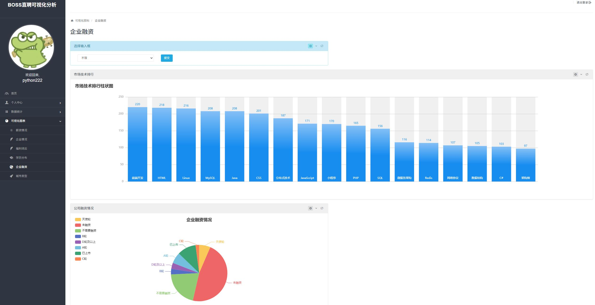
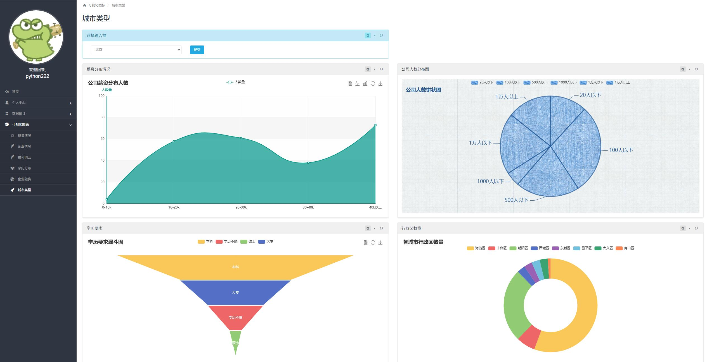

# 🎓 基于Selenium的招聘岗位数据采集与可视化分析系统

> **BOSS直聘岗位数据采集 · Django Web可视化 · 多维度数据分析**

[](https://www.python.org/)
[](https://www.djangoproject.com/)
[](https://www.selenium.dev/)
[](https://www.mysql.com/)
[](LICENSE)

## 📖 项目简介

本项目是**毕业设计**作品，旨在解决求职者在海量招聘信息中难以高效筛选和分析岗位的痛点。系统通过 **Selenium** 自动化采集 BOSS直聘 平台的招聘数据，利用 **Django** 框架搭建Web管理后台，结合 **ECharts** 实现数据的多维度可视化分析，帮助求职者直观了解行业薪资水平、技术栈需求和地域分布等关键信息。

### 🎯 解决的核心问题

- 🔍 **数据采集难** — 招聘网站反爬严格，传统爬虫无法有效采集
- 📊 **数据理解难** — 海量招聘信息缺乏结构化整理和分析工具
- 🧠 **决策依据少** — 求职者缺乏行业薪资、技术需求的宏观视角

## ✨ 核心功能

### 🔧 数据采集模块
- **Selenium自动化爬虫** — 模拟真实浏览器行为，绕过反爬虫检测
- **BOSS直聘实时搜索** — 支持多关键词、多城市、分页采集
- **智能数据清洗** — 自动去重、格式标准化、异常值处理
- **增量采集** — 支持断点续爬，避免重复数据

### 📊 数据可视化分析
| 分析维度 | 图表类型 | 说明 |
|---------|---------|------|
| 💰 薪资分析 | 柱状图/饼图/漏斗图 | 按学历、经验、城市多维度对比薪资 |
| 🏢 公司分析 | 柱状图/折线图/饼图 | 公司规模、融资阶段、行业类型分布 |
| 🎓 学历分析 | 柱状图对比 | 不同学历与工作经验的薪资关系 |
| 📍 地域分析 | 多维图表+词云 | 热门城市岗位分布、薪资地图 |
| 🛠 技术栈分析 | 横向柱状图 | 热门技术关键词频率与平均薪资 |

### 👤 用户系统
- **账号管理** — 注册/登录/密码修改/账号注销
- **手机验证码登录** — 短信验证码快捷登录
- **安全中心** — 登录日志、手机绑定、密码找回
- **个人收藏** — 岗位收藏与浏览历史

### 🔎 岗位搜索
- **多条件筛选** — 关键词、薪资范围、学历、经验、城市
- **BOSS直聘实时搜索** — 直接调用平台搜索接口
- **详情页展示** — 岗位完整信息、公司所有在招岗位
- **数据导出** — 一键导出搜索结果到Excel

## 🛠 技术栈

### 后端
- **Web框架**: Django 3.1
- **爬虫引擎**: Selenium 4.35 + ChromeDriver
- **数据库**: MySQL 8.0（支持SQLite后备）
- **数据处理**: Pandas, NumPy
- **分词工具**: jieba 分词
- **词云生成**: wordcloud + matplotlib

### 前端
- **可视化**: ECharts 5.x（柱状图、饼图、折线图、漏斗图、词云）
- **UI框架**: Bootstrap 响应式布局
- **交互**: AJAX 异步数据加载

### 关键依赖
```
Django==3.1.14
Selenium==4.35.0
Pandas==2.3.2
NumPy==2.3.3
PyMySQL==1.1.2
jieba==0.42.1
wordcloud==1.9.4
matplotlib==3.10.6
Pillow==11.3.0
```

## 🚀 快速开始

### 环境要求

- Python 3.9+
- MySQL 8.0（或使用SQLite）
- Chrome浏览器 + ChromeDriver

### 安装步骤

```bash
# 1. 克隆项目
git clone https://github.com/123wang380/boss-job-analysis-django.git
cd boss-job-analysis-django

# 2. 创建虚拟环境
python -m venv .venv
# Windows
.venv\Scripts\activate
# Linux/Mac
source .venv/bin/activate

# 3. 安装依赖
pip install -r requirements.txt

# 4. 配置数据库
# 编辑 数据可视化分析/settings.py 中的 DATABASES 配置
# 或直接使用 local_settings.py 中的 SQLite 配置（开箱即用）

# 5. 导入示例数据（可选）
mysql -u root -p admins < database/db_admins.sql

# 6. 数据库迁移
python manage.py migrate

# 7. 启动服务
python manage.py runserver
```

访问 http://127.0.0.1:8000/myApp/login/ 进入系统。

### 启动数据采集

```bash
cd spider
# 编辑 spiderMain.py 设置采集参数
python spiderMain.py
```

## 📁 项目结构

```
├── 数据可视化分析/          # Django 项目配置
│   ├── settings.py          # 主配置文件
│   ├── urls.py              # 路由入口
│   └── local_settings.py    # 本地开发配置（SQLite）
├── myApp/                   # 主应用
│   ├── views.py             # 视图逻辑（45+ 接口）
│   ├── models.py            # 数据模型（6个表）
│   ├── urls.py              # 应用路由
│   ├── utils/               # 业务工具模块
│   │   ├── getHomeData.py   # 首页数据聚合
│   │   ├── getSalaryCharData.py  # 薪资分析
│   │   ├── getCompanyCharData.py # 公司分析
│   │   ├── getSearchData.py # 搜索功能
│   │   ├── getTechStackData.py   # 技术栈分析
│   │   ├── getExportData.py # Excel导出
│   │   ├── boss_utils.py    # BOSS直聘工具
│   │   └── sms_utils.py     # 短信验证码
│   └── word_cloud_picture.py # 词云生成
├── spider/                  # 爬虫模块
│   ├── spiderMain.py        # 主爬虫（Selenium）
│   └── boss_live_search.py  # BOSS直聘实时搜索
├── middleware/               # 自定义中间件
│   └── userInfoMiddleWare.py
├── scripts/                 # 工具脚本
│   ├── create_user.py       # 创建用户
│   ├── enrich_data.py       # 数据补充
│   └── generate_seed_data.py # 生成种子数据
├── templates/               # 前端模板（20+ 页面）
├── static/                  # 静态资源
├── docs/screenshots/        # 系统截图
├── database/                # 数据库脚本
├── requirements.txt         # Python依赖
├── setup_env.ps1            # 环境配置脚本
└── manage.py                # Django管理入口
```

## 📸 系统截图

### 登录页面


### 数据仪表盘


### 薪资分析


### 公司分析


### 学历分析


### 职位搜索


### 技术栈分析


### 数据表格


## 🎯 技术亮点

1. **绕过反爬策略** — 使用Selenium模拟真实用户操作，包含等待机制和异常处理
2. **模块化架构** — 数据采集、清洗、存储、分析、展示各层分离，高内聚低耦合
3. **多维度可视化** — 12+ 种图表类型，支持动态筛选和联动查询
4. **完整的用户体系** — 从注册登录到安全中心，涵盖账号全生命周期
5. **实时+离线双模式** — 既有历史数据的离线分析，也支持BOSS直聘实时搜索
6. **数据库双兼容** — MySQL生产环境 + SQLite开发环境自动切换
7. **词云分析** — 基于jieba分词 + wordcloud的公司标签可视化

## 📝 数据库设计

系统包含6张核心数据表：

| 表名 | 说明 | 关键字段 |
|------|------|---------|
| `jobInfo` | 招聘岗位信息 | 岗位名、薪资、学历、经验、公司等20+字段 |
| `user` | 用户信息 | 用户名、密码(MD5)、手机号、简历信息 |
| `history` | 浏览历史 | 用户-岗位关联、点击次数 |
| `login_log` | 登录日志 | IP地址、登录方式、时间 |
| `verify_code` | 短信验证码 | 手机号、验证码、有效期 |

## 🔮 后续规划

- [ ] Docker容器化部署
- [ ] 接入更多招聘平台（拉勾、猎聘）
- [ ] 机器学习薪资预测
- [ ] RESTful API接口开放
- [ ] 定时自动采集任务
- [ ] 岗位推荐算法

## 📄 许可证

本项目为毕业设计作品，采用 MIT 许可证。

---

> 💡 **求职Tips**: 这个项目展示了全栈开发能力——从数据采集（Selenium爬虫）到后端开发（Django）再到前端可视化（ECharts），覆盖了数据工程的完整链路。对于数据分析、Python后端、爬虫工程师等岗位都是很好的项目经验。
